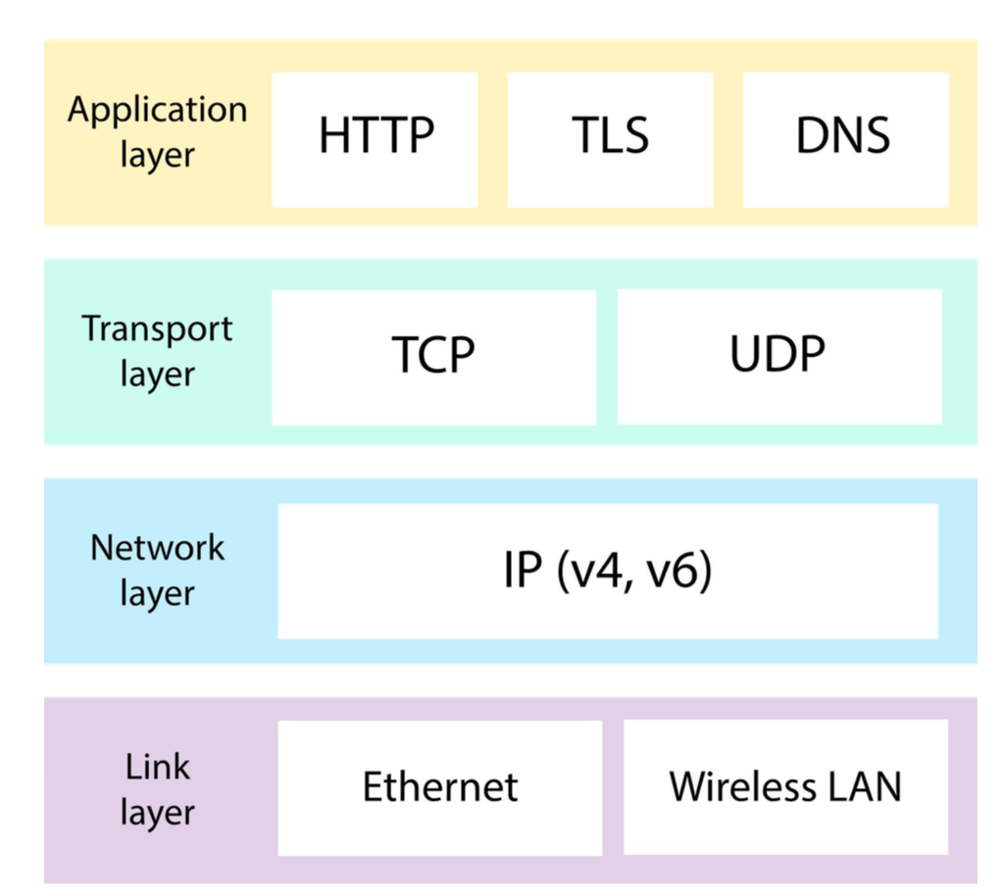

# Web Fundamentals Assignment

##### 1. What is a protocol stack, and how is it used in web development?

The protocol stack is a set of protocols that enables devices to communicate with each other on the internet. Each protocol operates at a different layer, building functionality on top of the layer below it.
In simple words, A protocol stack is a group of protocols that all work together to allow software or hardware to perform a function.
Four layers in the protocol stack are:

1. Link Layer :- It is the bottom most layer, where the devices physically send and receive digital data over wired or wireless connections. They send electromagnetic signals and interpret the signal as bits.
2. Network Layer :- To communicate beyond two directly connected devices, we need addressing protocols to identify the sender and receiver of data. To uniquely identify each device on the internet, IP addresses are used.
3. Transport Layer :- This layer manages the reliable and orderly delivery of the Data which is divided into small packets for efficient transmission. TCP (Transmission Control Protocol) ensures data is delivered accurately, while UDP (User Datagram Protocol) provides faster but less reliable communication.
4. Application Layer :- This is the top layer where we find various protocols that cater to specific services and applications on the internet. For example, HTTP is used for accessing web pages, DNS is used to translate domain names into ip addresses, TLS is used to encrypt data for secure transmission.

When a message is sent through the Internet, it doesn't use every protocol in the suite. It does use at least one protocol from every layer, however.
If the website uses HTTPS, the protocol stack includes:

| Layer | Protocols |
| ------ | ------ |
| Application Layer | HTTP and TLS |
| Transport Layer | TCP |
| Network Layer | IP (v4) |
| Link Layer | Ethernet or Wireless LAN |

***

##### 2. What are the different types of web servers, and how do they differ in terms of functionality and performance?

Web server is a program which processes the network requests of the users and serves them with files that create web pages. This exchange takes place using Hypertext Transfer Protocol (HTTP). This server is always connected to the internet.

| No | Web Servers |
| ------ | ------ |
| 1 | Apache HTTP Server |
| 2 | Microsoft Internet Information Services |
| 3 | Lighttpd |
| 4 | Sun Java System Web Server |
| 5 | Jigsaw Server |
| 6 | Nginx |

The web server accepts and processes requests from end users for static website content. Thus, It consumes fewer resources such as CPU or memory compared to other servers and provides a runtime environment for web applications. Also, the storage requirements are minimal for web servers. Its easier to scale a web server horizontally by adding more web servers. Also, Web servers are generally simpler to set up and maintain.

***

##### 3. What is web hosting, and what are the different types of hosting services available for websites?

Web hosting is an online service that allows us to deploy our website files onto the internet. So, anyone who has access to the internet and the domain name (or ip) has access to our website.

Types of hosting services:

1. Shared Hosting :- Shared hosting is when a web hosting provider hosts a number of different websites on the same server. It is like sharing an apartment with roommates. Multiple websites share the same server resources, such as storage, memory, and processing power. It can be used when the website is small and has less traffic.

2. VPS Hosting (Virtual Private Server) :- VPS hosting is like renting a private room in a shared house. Like shared hosting, websites that run on VPS share a physical server with other websites. However, each VPS tenant has its own partition with guaranteed dedicated resources. There’s often more memory, storage and processing power available – with a price tag to match. It can be used when the website traffic is increasing and better performance is required.

3. Dedicated Hosting :- Dedicated hosting means you have the entire server to yourself. It gives you access like a VPS, but you don’t have to share the server with other sites or apps. Its like owning a standalone house, it offers the highest level of performance and customisation. It can be used when the website is large with high traffic.

4. Cloud Hosting :- Cloud hosting is like living in a flexible apartment building. It uses multiple interconnected servers to provide scalability and reliability. It can be used when the traffic is varying so that the resource can be scaled up or down dynamically.

5. Managed WordPress Hosting :- Managed WordPress hosting is like having a maintenance team for your WordPress website. The hosting provider takes care of updates, backups, and security.

6. Reseller Hosting :- Reseller hosting is like being a middleman. You purchase hosting resources in bulk from a provider and sell smaller hosting plans to others.

##### 4. What is scaling, and why is it important for web applications? How does scaling differ for vertical and horizontal scaling?

Scaling is the process of increasing a website's capacity to handle more users, traffic, and requests. As a website's traffic increases, it leads to slower response times and potential crashes. Scaling helps ensure that the website remains accessible and responsive even during high traffic periods.

Two types of scaling:

1. Vertical Scaling or scaling up involves increasing the resources (such as CPU, RAM, or storage) of an existing server. It's like adding more power to a single machine to handle more load. It can be used when the website experiences increased traffic, but have limited resources to invest in additional servers. It is ideal for small-scale websites.

2. Horizontal scaling or scaling out involves adding more servers to the infrastructure. It's like having multiple machines working together to share the load. It can be used when the website faces rapid growth and a significant increase in traffic, and a single server can no longer handle the load efficiently. It is ideal for large-scale websites.

##### 5. What is SEO (Search Engine Optimisation), and how can web developers optimise their websites for better search engine rankings?

SEO is the process of taking steps to help a website or piece of content rank higher on Google. It means taking a piece of online content and optimising it so search engines like Google show it towards the top of the page when someone searches for something.

Web developers can optimise their websites for better search engine rankings by using the measurement tools such as Google Webmaster Tools or Bing Webmaster Tools. Following are the steps that can be followed to optimise the websites:

1. Keyword Research: Use keyword research tools to find relevant and popular keywords related to the blog's content.

2. Optimise Content: Incorporate the selected keywords naturally into the blog posts' titles, headings, and content. Ensure the blog's content is informative, engaging, and valuable to readers.

3. Meta Tags and Descriptions: Create compelling meta tags and descriptions for each blog post, as these elements appear in search engine results and can influence click-through rates.

4. Submit Sitemap: Submit the blog's sitemap to Google and Bing Webmaster Tools to ensure search engines can crawl and index the pages efficiently.

5. Measure and Analyse: Use Google Webmaster Tools and Bing Webmaster Tools to monitor the blog's performance, track search queries, and identify any issues that need attention.
